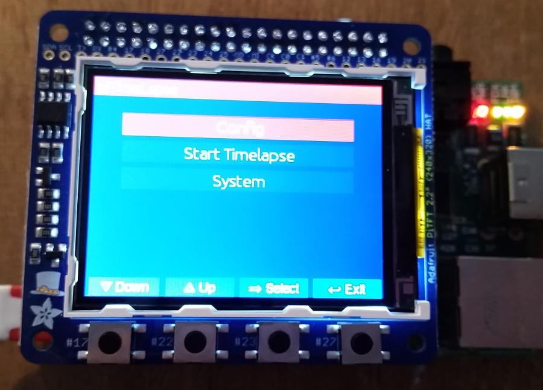

# piTimeLapse

piTimeLapse is a program to run on a Raspberry PI and a piTFT display module with some additional
electronics to drive a stepper motor and control a DSLR camera to produce moving time lapse movies.

This is work in progress and not yet working in any way!

